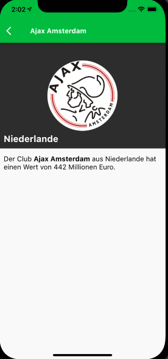
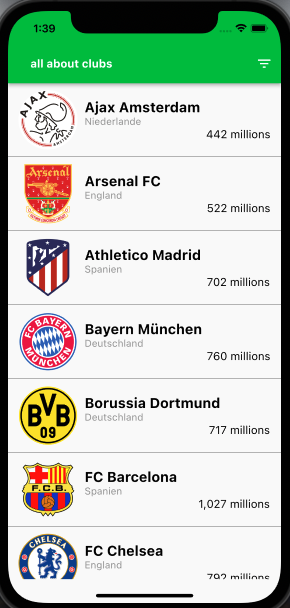
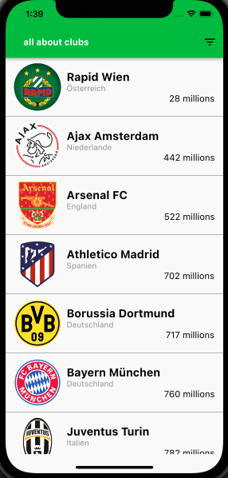

# fussball_teams
## Uebersicht

Ein Kunde benötigt eine App, die eine aktuelle Rangliste von europäischen Fußball-Spitzenteams darstellt. Das Ranking anhand der Marktwerte wird täglich neu berechnet.

## Anforderungen

- App soll lauffähig sein unter Android 6.0, iOS 12+ & iPhone only (optional)
- Hauptfarbe: #01C13B
- App soll für Lokalisierung vorbereitet sein. Unter anderem ist es geplant, für einen späteren Release, dass neben Deutsch noch Englisch und Polnisch unterstützt werden.
- Ein Design befindet sich auf den nachfolgenden Seiten.
- Die Daten der App sind unter folgender Url erreichbar
https://public.allaboutapps.at/hiring/clubs.json
- Die App soll in Zukunft auch für andere Märkte genutzt werden können. Diese “App-Klone” werden eine andere Web-Schnittstelle und Farben benutzen, der Rest soll übernommen werden.
- Die App sollte sich gut anfühlen: korrekte Fehlerbehandlung, einem sinnvollen UX folgen 

## Screenshots

